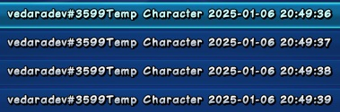
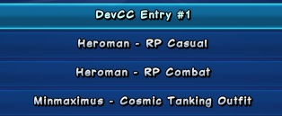

Note: project/repo name is just a working title and may change in the future.
# Champions Costume Manager 2
An offline tool for managing in-game displays of costume save files in Champions
Online. This will initially be a command-line tool but the plan is to eventually
have a functional GUI serve as the primary form of user interaction.

## Why?
Champions Online has an amazing character ("costume" in Champions parlance)
creator but little to no support for managing and organizing the hundreds of
saved costume files that any avid costumer will inevitably generate. To make
matters worse, the default in-game display of costume saves takes the form of
the unruly and often unhelpful `accountnameCharactername Date Time`. Costume
saves are comprised of costume-specific metadata embedded in JPEG image files,
and since the display names of save files in-game are derived from a combination
of this metadata the filename itself, deviating from the default format is a
difficult task for anyone without knowledge of the JPEG format and either a hex
editor or a programming language and image parsing library.

In short, as a starting point, this tool aims to provide a trivial way for users
to change the in-game displays of their saved costumes from this

to something much nicer and more maintainable:

## Quick Start
TODO

## Usage
TODO

## Contributing
This project isn't far enough along to accept contributions yet.
